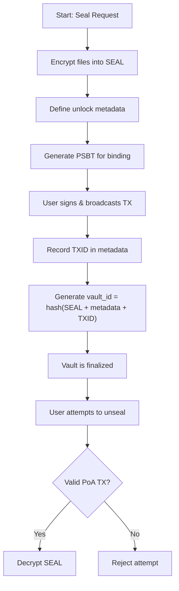
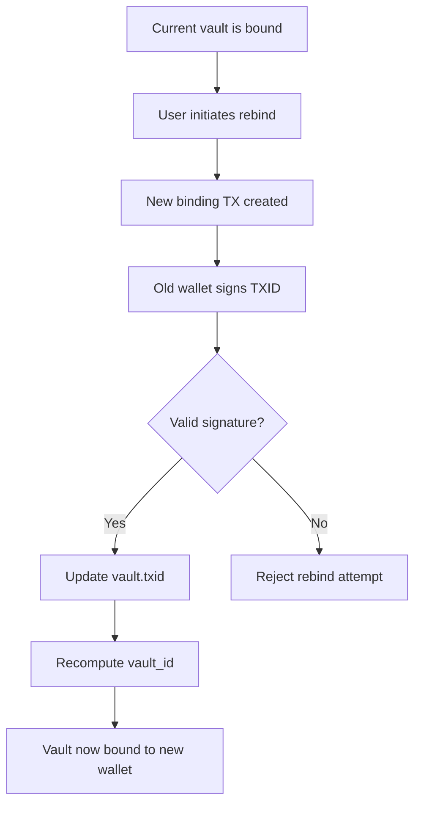

# LOCK: Verifiable Access Through Proof-of-Work, Not Permission.

<aside>

**Published by:** Bram Kanstein ([https://x.com/bramk](https://x.com/bramk))  
**Version:** 1.0  
**Published:** May 18, 2025

</aside>

## **1. Introduction**

Digital access is broken.

Today, we depend on passwords, cloud providers, and centralized APIs — systems that can censor, leak, or vanish overnight. Access isn’t owned; it’s rented.

**LOCK (Ledger-Originated Cryptographic Key)** changes that.

It introduces a protocol where access isn’t granted — it’s **proven**. Proven by broadcasting a valid Bitcoin transaction. No middlemen. No overrides No trust.

In LOCK, a digital secret — such as a file, message, or instruction — is sealed into an encrypted vault. Only a Bitcoin transaction that meets the vault’s cryptographic conditions can unseal it.

There are no passwords. No accounts. No servers to hack.

Just energy, ownership, and proof.

- **For individuals**: Truly self-sovereign secrets. No more “Forgot password?”
- **For enterprises**: Tamper-proof access control. No more “Admin revoked your rights.”
- **For developers**: A protocol for verifiable access — programmable, Bitcoin-enforced, and trustless by default.

This isn’t just a new tool. It’s a new category: verifiable access to digital secrets, enforced by energy and ownership.

## **1.1 A New Access Primitive**

LOCK formalizes a discovery: that a **Bitcoin transaction**, under strict constraints, can act as a **sovereign access key** to any encrypted vault — without storing anything on-chain.

You are not embedding secrets *in* Bitcoin. You are building an **access layer on top of it**, secured by the same hash power that protects the world’s hardest money.

A SEAL is a digital vault.

A Bitcoin transaction is the key.

And access is determined by energy and ownership — not by trust.

This is access as projection of force: the act of spending sats becomes the cryptographic trigger for revealing truth. Whether the secret is a file, a phrase, or an instruction, **only someone who proves wallet control and pays a defined fee** can unseal it. (Throughout this paper, we use **unseal** instead of *unlock* to reflect the cryptographic nature of access in LOCK.)

LOCK extends Bitcoin’s security guarantees to **file systems**, **dead drops**, **time-locked payloads**, and even **physical safes**. If it can be encrypted, it can be sealed. If it can be validated by the blockchain, it can be unsealed — **permissionless.**

This is a new access primitive:

- Stateless
- Serverless
- Verifiable anywhere
- Secured by the most objective system of record ever created

It’s Bitcoin-based access — not identity-based access. And it changes what becomes possible.

## **2. The Sovereign Access Layer (SAL)**

LOCK lives within a broader design philosophy we call the **Sovereign Access Layer** (SAL). SAL reframes access control through the lens of **cryptographic ownership and proof-of-work**.

In SAL:

- Your **wallet is your username**.
- Your **Bitcoin transaction is your password** — not just a signature, but a visible projection of control.

Your **right to access** is not given. It is **enforced by the chain**.

There is no server-side session, no credential check, and no trust assumption. Instead, there is only the act of **signing and broadcasting** a valid transaction that meets predefined vault conditions. That is what triggers unsealing. That is what proves you are entitled to access.

SAL redefines access as something **you control**, not something a (centralized) system grants.

## **3. Protocol Overview**

LOCK defines a system for sealing encrypted data (called a **SEAL**) and binding it to a specific Bitcoin wallet using a real Bitcoin transaction. The core components are:

- **SEAL** – The encrypted file itself.
- **Vault Metadata** – Defines how the file can be unsealed (fee rules, time-locks, wallet requirements, access limits).
- **Binding Transaction** – A small, signed Bitcoin transaction that cryptographically proves wallet ownership.
- **Proof-of-Access (PoA)** – The validation engine that checks whether an unlock attempt matches the required conditions.

LOCK does not rely on OP_RETURN, external identity providers, or any on-chain storage. It uses:

- Signed Bitcoin transactions
- Encrypted metadata
- Deterministic vault IDs (based on TXID, SEAL, and metadata)

And nothing else.

Access is enforced off-chain, validated on-chain, and secured by the same hash power that backs Bitcoin’s monetary finality.

## 3.1 Vault Lifecycle & Rebinding (Diagram)

The following diagrams illustrate the core vault flow and rebinding logic:

### 🔐 Vault Lifecycle



### 🔁 Rebinding



## **4. Vault Creation (Sealing Flow)**

In LOCK, vaults are not “created” by clicking a button. They are created by **sealing a payload and binding it to a Bitcoin wallet** through a real transaction. The protocol recognizes a vault as valid only if it has been properly **sealed and bound**.

### 🔁 **Protocol Flow: seal → bind → finalize**

### **Step 1: Seal Request**

The user defines:

- The digital secrets (e.g. files, messages, instructions) to include (which are encrypted into a SEAL)
- The PoA conditions:
    - **Fee logic** — fixed amount, defined range, or randomized default
    - **Unlock count** — one-time, N-times, or infinite
    - **Time-lock** — optional block height constraint
    - **Metadata visibility** — encrypted by default, plaintext opt-in

The client prepares the SEAL and vault metadata.

No binding or finalization occurs yet.

### **Step 2: Binding Transaction**

The protocol generates a **PSBT** for the user:

- A Bitcoin transaction that either sends funds:
  - back to the sender (a self-spend), or
  - to a specific `recipient_wallet` address
- The amount is specified by the `amount_condition` field in the vault metadata (Can be fixed or a randomized range)

The user signs and broadcasts this transaction from the **wallet that will own the vault**.

Once the transaction is confirmed:

- Its TXID is recorded in the vault metadata
- The vault is now **cryptographically bound** to the transaction and the signing wallet

> ⚠️ LOCK vaults must only be finalized once the binding transaction is confirmed in a Bitcoin block and is not replaceable (RBF-disabled).  
> RBF-enabled transactions can be evicted from the mempool or replaced before confirmation, weakening the vault’s guarantee of finality and tamper resistance.  
> Clients must enforce this to avoid transaction eviction or rebinding hijacks.  
> The `vault_id` must only be derived once the TX is final.

### **Step 3: Finalization**

With the TXID confirmed:

- The SEAL and metadata are finalized and optionally stored or shared
- The vault ID is generated: `vault_id = SHA-256(SEAL_bytes || metadata_bytes || txid_bytes)` — using canonical encoding and byte-order. See `CLIENT_COMPLIANCE.md` for details.
- The vault becomes **valid** and unlockable under the LOCK protocol

At this point, only a Bitcoin transaction matching the vault’s **PoA logic** can unlock the SEAL.

> ⚠️ No vault is considered valid in LOCK unless it has a binding transaction.
> 
> 
> This ensures that ownership is provable, tamper resistance is maintained, and unlock logic has an immutable anchor on-chain.
> 

## **4.1 Separation of Payload and Access**

In most systems, the mechanism to access a secret is tightly coupled to where that secret is stored.

Passwords live on servers. Keys sit next to files. Secure messaging apps host both content and control.

**LOCK breaks this completely.**

With LOCK:

- The **SEAL** (the encrypted file or secret) can live anywhere — offline, on a USB drive, in cloud storage, printed on paper, or even fragmented across peers.
- The **unlock condition** lives on Bitcoin — immutable, verifiable, and independent of location.

There is **no required connection between where the file is stored and where the access logic is enforced**.

> A SEAL could sit in a drawer in Zurich.
> 
> 
> The unlocking transaction could be broadcast from a cold wallet in El Salvador.
> 
> And the validation could happen from any node, anywhere on Earth.
> 

This decoupling has powerful implications:

- Vaults can be **physically distributed** and still remain secure
- Secrets can be **shared without exposing control**
- Unlock logic can be **audited, but not tampered with**
- You can **trigger access** from one place and **retrieve the file** in another

It also enables **dead-drop scenarios**, **multi-device workflows**, and **sovereign key handoffs** without needing central infrastructure.

> The payload and the unlock action are not just separate — they are sovereignly decoupled. That is what makes LOCK fundamentally different from encryption tools, cloud keys, or password managers.
> 

## 4.2 Canonical Vault ID Construction

The `vault_id` is computed as:

`vault_id = SHA-256(SEAL_bytes || metadata_bytes || txid_bytes)`

To ensure consistent vault IDs across clients:

- `SEAL_bytes` refers to the full binary contents of the `.seal` file
- `metadata_bytes` must be a canonical, deterministic encoding (e.g. **CBOR** or UTF-8 JSON with sorted keys and no whitespace)
- `txid_bytes` is the raw 32-byte little-endian transaction ID of the binding TX

Clients must agree on these conventions to ensure cross-compatibility. Diverging formats will produce mismatched vault IDs and break unlock validation.

## **5. Vault Unlocking (Proof-of-Access)**

Once a vault is sealed and bound, it becomes accessible **only through a Bitcoin transaction** that satisfies its unlock conditions. This is the essence of **Proof-of-Access (PoA)** — a protocol-verified check that confirms:

- **The transaction is from the correct wallet**
- **The fee paid matches the required logic**
- **The transaction occurs after any time-lock (block height)**
- **The vault has not exceeded its unlock limit**

This is not about decryption keys. It’s about **provable Bitcoin activity** matching vault logic — cryptographically, publicly, and irreversibly.

### 🔍 PoA Engine: What Gets Checked

To unseal a vault, a user submits a Bitcoin transaction. The PoA engine performs the following checks:

| Condition | Purpose |
| --- | --- |
| **Origin Address Match*** | Ensures the transaction is signed by the bound wallet |
| **Amount Condition Match** | Verifies the total amount spent in the transaction matches the required amount/range |
| **Recipient Match** | Confirms the BTC was sent to the required wallet (self or third party) |
| **Time-lock Match** | Confirms block height is at or beyond minimum required height |
| **Unlock Count Match** | Ensures the vault hasn’t been unsealed too many times (if limited) |
| **TXID Validation** | Confirms the transaction is real, confirmed, and unique |

If all conditions are met, **the SEAL is decrypted and the user gains access**. If any condition fails, the vault remains sealed.

<aside>

***”Origin Address Match**” **Note**
`tx_from_bound_wallet()` must cryptographically verify that one of the transaction’s inputs was signed by the private key controlling the `authorized_wallet`.
This typically involves:\n
- “Extracting the public key from `scriptSig` (P2PKH) or `witness` (P2WPKH, Taproot)\n”
- ”Deriving the address from that public key\n”
- ”Comparing it to the `authorized_wallet` field in the vault metadata\n Clients must reject any unlock TX that fails this ownership check.”

</aside>

### 📤 Spend-to-Trigger: Self or External

LOCK vaults are unlocked by real Bitcoin transactions that meet all Proof-of-Access conditions. These include:

- A **self-spend** (sending funds back to your own wallet)
- A **payment to a specific recipient** (`recipient_wallet`)
- A **public unlock** from any wallet (if `authorized_wallet = "ANY"`)

These transaction patterns allow LOCK vaults to enforce access via:

- Energy expenditure (through miner fees)
- Ownership (proven via signatures)
- Optional payment (to a designated wallet)

> Self-spend remains the **default PoA trigger** — minimal, auditable, and sovereign.

> Note: LOCK does not validate miner fees directly.
The `amount_condition` field specifies how much must be spent in the unlock transaction — not how much is paid as fee. Clients should estimate and include a suitable network fee based on mempool conditions, but only the total **spent amount** (inputs minus change) is validated for PoA.

### ⏱ Time-Locks via Block Height

LOCK supports time-based unlocks by using **Bitcoin block height**, not wall time. This makes time-locks tamper-resistant and globally verifiable.

For example:

> “Vault unlockable after block 850,000”
> 
> 
> ...is enforced not by a server clock, but by the Bitcoin network’s consensus reality.
> 

This ensures no party — not even the vault creator — can override the timer.

### 🔄 Unlock Counters (Optional)

Vaults can specify:

- **Single-use unlock**
- **N-use unlock**
- **Unlimited unlock**

The PoA engine enforces this by:

- Checking current unlock count (stored off-chain by the client or via audit logs)
- Rejecting unlocks beyond the allowed limit

Clients are responsible for persisting this counter securely. LOCK ensures the logic exists to enforce it.

## **6. Rebinding Vault Ownership**

A key feature of LOCK is the ability to **rebind** a vault to a new wallet. This is critical for:

- Key rotation
- Lost key recovery (if you still have access to the old wallet)
- Delegation or handoff to another party
- Inheritance and posthumous vault access

### 🔁 Rebinding Flow

1. The current owner signs a new **binding transaction** from the existing wallet
2. This new TXID becomes the updated anchor for the vault
3. Vault metadata is updated to reflect the new wallet
4. The vault ID changes (since the TXID changes)
5. The unlock counter can be optionally reset or inherited

LOCK requires the old wallet to sign the rebinding — this prevents unauthorized hijacking of vaults.

### ⚖️ Rebinding: Protocol vs Product

LOCK defines rebinding as a **core protocol primitive**. Whether apps choose to expose it (e.g. via GUI or API) is up to the product.

This is the difference:

- **LOCK enforces rebinding via Bitcoin TX + old wallet signature**
- **UNSEAL or other clients choose whether to monetize or restrict it**

## **6.1 Protocol vs Client Responsibilities**

LOCK is a protocol — not a product. It defines a minimal, verifiable system for sealing encrypted files, binding them to Bitcoin wallets via transactions, and enforcing unlock conditions through Proof-of-Access (PoA).

What LOCK **does not** define:

- How vaults are stored or displayed
- How users sign transactions
- Where or how metadata is hosted
- How user interfaces handle workflows or errors

These are the responsibilities of **clients** that implement LOCK.

### 🧩 The Split

| **LOCK Protocol** | **Client Implementation** |
| --- | --- |
| Defines `seal`, `bind`, `unseal`, `rebind` | Implements those in code |
| Specifies unlock logic via PoA | Handles signing, storage, UI |
| Validates access via Bitcoin TXs | Generates, signs, and broadcasts transactions |
| Requires encrypted metadata | Chooses how and where to store it |
| Must be interoperable and minimal | Can be opinionated and feature-rich |

Clients may extend the protocol with:

- PSBT support
- Signature-based rebinding
- Vault expiration timers
- Self-destruct logic
- Multi-vault management interfaces

As long as implementations remain compatible with LOCK’s validation rules, they are considered fully compliant.

This separation ensures LOCK remains stable, open, and **interoperable across platforms**, while still allowing innovation and customization at the client level.

> 🔍 Note on Protocol Primitives
From this point forward, short pseudocode blocks will appear where relevant. These are not full implementations or product code — they clarify core protocol logic in a language-neutral way. LOCK is a protocol, not an app. These snippets illustrate what must be enforced, not how it should be built.
All signing and broadcasting is assumed to occur via external Bitcoin wallets. LOCK only validates.
> 

## **7. Protocol Primitives (Pseudocode)**

The LOCK protocol defines four core actions that determine the lifecycle of a vault: `seal`, `bind`, `unseal`, and `rebind`.

These are expressed here in minimal pseudocode to clarify protocol logic. They are not full implementations, but serve as formal references for any compliant client.

All signing and transaction broadcasting are assumed to happen via external Bitcoin wallets. LOCK only validates inputs and enforces unlock conditions.

🔐 `seal(files, unlock_metadata)`

Creates a draft vault by encrypting the payload and unlock conditions.

```python
def seal(files, unlock_metadata):
    seal = encrypt(files)                   # Create SEAL (the encrypted payload)
    metadata = encrypt(unlock_metadata)     # Encrypt unlock conditions
    return draft_vault(seal, metadata)      # Not yet bound to a TX
```

🔗 `bind(draft_vault, signed_tx)`

Binds a draft vault to a specific Bitcoin wallet by anchoring it to a signed transaction.

```python
def bind(draft_vault, signed_tx):
    assert validate_transaction(signed_tx)
    txid = extract_txid(signed_tx)

    draft_vault.txid = txid  # Bind vault to TXID

    # Compute canonical vault_id as SHA-256(SEAL || metadata || TXID)
    vault_id = sha256(draft_vault.seal + draft_vault.metadata + txid)

    draft_vault.id = vault_id

    return finalized_vault(draft_vault)
```

🔓 `unseal(vault, broadcast_tx)`

Validates whether a submitted transaction satisfies the vault’s PoA conditions. If valid, decrypts the SEAL.

```python
def unseal(vault, broadcast_tx):
# Verify transaction is signed by authorized wallet, not just bound txid
    if not tx_from_authorized_wallet(broadcast_tx, vault.metadata.authorized_wallet):
        raise Exception("Wallet mismatch")
    
    if not amount_matches(vault.metadata.amount_condition, broadcast_tx):
    raise Exception("Amount condition not satisfied")

    if not recipient_matches(vault.metadata.recipient_wallet or "self", broadcast_tx):
        raise Exception("Recipient wallet mismatch")

    if vault.metadata.time_lock and not is_after_block(vault.metadata.time_lock, broadcast_tx):
        raise Exception("Time-lock not yet satisfied")
    
    if vault.metadata.unlock_limit:
        if get_unlock_count(vault.id) >= vault.metadata.unlock_limit:
            raise Exception("Unlock limit exceeded")
    
    return decrypt(vault.seal)
```

🔁 `rebind(vault, new_tx, old_wallet_signature)`

Transfers ownership of a vault to a new wallet by re-binding it to a new transaction, signed by the original owner.

```python
def rebind(vault, new_tx, old_wallet_signature):
    if not verify_signature(vault.txid, old_wallet_signature, vault.bound_wallet_pubkey):
        raise Exception("Invalid signature from current owner")
    
    new_txid = extract_txid(new_tx)
    vault.txid = new_txid
    vault.id = hash(vault.seal + vault.metadata + new_txid)
    
    return updated_vault(vault)
```

These four functions define the entire LOCK protocol lifecycle.

Any client that correctly implements this logic — and validates unlock attempts against these conditions — is considered **LOCK-compliant**.

## **8. Metadata & Encryption**

In LOCK, vaults consist of two core encrypted components:

1. **The SEAL** — the encrypted file payload
2. **Vault Metadata** — the encrypted unlock conditions

Both are sealed off-chain and remain unreadable without a valid unlock. This dual-encryption model ensures that:

- The contents of the vault remain secret
- The *rules for access* remain tamper-proof and opaque (unless intentionally revealed)

---

### 🧱 Metadata Structure

Vault metadata defines the PoA conditions. It is structured before sealing and includes the following fields:

| Field | Description |
| --- | --- |
| `authorized_wallet` | The wallet address that must sign the unlock transaction (or `ANY` to allow public unlocks) |
| `amount_condition` | The required Bitcoin amount to be spent in the unlock transaction. Can be fixed or a randomized range |
| `time_lock` | Optional minimum block height required before unsealing |
| `unlock_limit` | Optional number of allowed unseals (1-time, N-time, infinite) |
| `visibility` | Either `encrypted` (default) or `plaintext` |
| `txid` | The transaction ID used to bind the vault |

> 🔐 Clients may add additional metadata fields, but LOCK only enforces what it can validate on-chain.
> 

### 🔐 Metadata Encryption

All metadata is encrypted by default using symmetric encryption (e.g. AES-256-GCM or ChaCha20-Poly1305), with a key known only to the vault creator.

The encryption key is derived via an ECDH + HKDF scheme:

`shared_secret = ECDH(my_private_key, peer_pubkey)`

`metadata_key = HKDF(shared_secret || seal_hash)`

See `KEY_DERIVATION.md` for full implementation details.

This ensures:

- Unlock conditions are **not visible** to observers unless made public
- Vaults cannot be profiled or targeted based on unlock logic
- Attackers cannot guess amount conditions or time-lock values

Plaintext metadata is permitted for use cases like public drops or tamper-evident broadcasting, but must be opted into explicitly.

⚠️ For public vaults using `authorized_wallet = ANY`, clients must take extra care to prevent fee-sniffing attacks or preemptive unlocks.

Recommended mitigations include:

- Encrypting metadata even when publishing the vault
- Using randomized fee logic (e.g., `fee_requirement = random`)
- Avoiding vault exposure until unlock is expected

<aside>

### 🔑 Key Derivation & Recovery Note

By default, clients should derive the **metadata encryption key** using a secure key agreement tied to the bound wallet — for example:

```
scss
CopyEdit
HKDF(key = wallet_pubkey || SEAL_hash)
```

Recovery strategies depend on:

- Whether the metadata is **re-encryptable**
- Whether **delegation** or **rebinding** is allowed

LOCK does **not mandate** how encryption keys are generated or stored — only that **metadata must be encrypted prior to binding**.

Implementations should define a secure, consistent **derivation path** tailored to their security model.

</aside>

### 📦 SEAL Format (Encrypted Payload)

The SEAL is the encrypted version of the user’s payload (e.g. file, message, or digital object), plus minimal metadata to support decryption.

> Sealed vaults are typically stored as standalone .seal files — portable, encrypted, and ready for PoA-based unlocking.
> 

| Component | Description |
| --- | --- |
| `nonce` | Random value to ensure encryption uniqueness |
| `ciphertext` | Encrypted file bytes |
| `encryption_algo` | Algorithm used (e.g. AES-256-GCM) |
| `integrity_tag` | Authentication tag for verifying decryption |

Clients are responsible for:

- File chunking (if needed)
- Compression (optional)
- MIME/type metadata (if useful to user)

LOCK only requires that the SEAL be encrypted, verifiable, and decryptable once PoA is satisfied.

🔄 `create_metadata()`

Defines a vault's unlock logic, then encrypts it.

```python
python
CopyEdit
def create_metadata(wallet, fee, time_lock=None, unlock_limit=None, visibility="encrypted"):
    metadata = {
        "authorized_wallet": wallet,
        "fee_requirement": fee,
        "time_lock": time_lock,
        "unlock_limit": unlock_limit,
        "visibility": visibility
    }
    return encrypt(metadata)
```

> **Note:** The `txid` used to bind the vault is appended during the `bind()` phase — not here. This keeps sealing and ownership binding cleanly separated.
> 

🔐 `create_seal()`

Encrypts one or more digital secrets (files) into a sealed payload.

```python
python
CopyEdit
def create_seal(files):
    plaintext = combine_files(files)
    seal = encrypt(plaintext)
    return seal
```

## **9. Vault Templates & Use Cases**

The LOCK protocol defines a small, powerful set of primitives — but these primitives are composable. By adjusting unlock metadata, time constraints, and encryption visibility, clients can create a wide range of vault behaviors.

These are not separate features or plugins — they are **templates**, built from the protocol's native logic.

### 📬 9.1 Broadcast Vault

A vault sealed with **public metadata** and no unlock limit.

- Anyone can unseal the vault by broadcasting a valid self-spend from the specified wallet.
- Useful for:
    - Publishing encrypted payloads with public proof-of-origin
    - Sending time-locked messages or declarations
    - Creating “proof-backed” digital releases

> Like a tamper-evident envelope, openable only by the owner — but publicly visible and cryptographically anchored.
> 

### ☠️ 9.2 Burn-After-Unseal Vault

A **single-use vault** that self-destructs (becomes inaccessible) after one unlock. It’s basically a one-time access code or seed phrase.

- `unlock_limit = 1`
- Client optionally deletes SEAL and metadata after use
- Useful for:
    - One-time passwords or secrets
    - Secure drop links
    - Private key or seed delivery

> Accessed once, then gone — verifiable by transaction history.
> 

### ⏳ 9.3 Time-Locked Vault

Vault unlockable only after a specific **Bitcoin block height**

- No external timers or clocks
- No centralized enforcement
- Immutable unlock schedule

Common use cases:

- Personal messages for future self
- Dead man switches or delayed delivery
- Bitcoin-native publishing embargoes

> “Schedule a legal document release for a future date” / "This secret can’t be unsealed until block 860,000."
> 

### 📤 9.4 Broadcast & Delegate Vault (And Opening Permissions)

A vault that can be unsealed by a third-party wallet, defined at sealing time.

- `authorized_wallet = different from sealing wallet`
- SEAL may be public or encrypted
- Can be used to:
    - Give controlled access to partners, clients, successors
    - Implement non-custodial file handoffs

> A sealed vault you give someone else the key to — but they must prove it on-chain.
> 

### 🔁 9.5 Rebindable Vault

A vault with **explicit support for future ownership changes**.

- Original creator includes delegation metadata or flags for client display
- Vault can be re-bound by signing a new binding transaction with the original wallet
- Used for:
    - Key rotation and wallet hygiene
    - Inheritance scenarios
    - Transferring access without revealing content

> Not just who can unlock now — but who can be trusted to unlock later.
> 

### 🌐 9.6 Ultra-Minimal PoA Vault

A vault that can only be unsealed by submitting a transaction with a **matching fee**, from a specific wallet — no additional metadata, no OP_RETURN, no UI.

- `fee_requirement = fixed`
- `authorized_wallet = required`
- Clients validate unlock purely from on-chain transaction matching

Use cases:

- Machine-readable vaults
- Offline/unattended access control
- Lightweight integrations

> Sovereign proof via nothing but sats and signatures.
> 

**📥 9.7 Pay-to-Access Vault**

A vault that anyone can unlock — if they pay the defined fee.

- `authorized_wallet = ANY`
- `fee_requirement = fixed (e.g. 0.01 BTC)`
- `time_lock` optional

Use cases:

- Monetized document delivery
- Pay-per-view access to sealed content
- Public vault unlock challenges or bounties

> Anyone can unlock this vault — as long as they **pay the required cost in sats**. The transaction itself is the proof of permission.
> 

These templates are not protocol features — they’re **expressions of the same core logic**. By adjusting just a few values in the metadata, vault behavior can shift from ephemeral to eternal, private to public, solo to shared.

The LOCK protocol stays minimal.

The possibilities remain infinite.

## **10. LOCK vs Traditional Systems**

To understand the power of LOCK, it's helpful to compare it to the systems people use every day to manage access: passwords, centralized servers, OAuth flows, and even asymmetric encryption (like PGP).

LOCK doesn’t replace encryption — it wraps it in an access layer that’s **verifiable, decentralized, and economically enforced.**

### 🔐 Password-Based Access

| **Feature** | **Traditional Passwords** | **LOCK** |
| --- | --- | --- |
| Dependency | Central server | Bitcoin + encrypted file |
| Trust model | You trust a database | You trust your signature |
| Revocability | Admins can reset | Nobody can override |
| Leak risk | High (phishing, reuse) | None (no shared secret) |
| Offline functionality | No | Yes |

> Passwords require trust in the system. LOCK requires only proof.
> 

### 🌐 OAuth and Login Systems

| **Feature** | **OAuth / SSO** | **LOCK** |
| --- | --- | --- |
| Requires identity | Yes | No |
| Requires internet | Yes | Only to broadcast TX |
| Platform dependency | Fully centralized | Fully protocol-driven |
| Auditability | Opaque | On-chain + verifiable |
| Gatekeeper | Provider (Google, etc.) | You (your key, your rules) |

> OAuth authenticates you. LOCK proves you.
> 

### ✉️ PGP / Encrypted Email

| Feature | PGP | LOCK |
| --- | --- | --- |
| Encryption | Yes | Yes |
| Key distribution | Manual / fragile | Not needed |
| Access control | Based on decryption key | Based on Bitcoin transaction |
| Time-based unlocks | No | Yes (block height) |
| Delegation | Complex | Native (via rebinding) |
| Verifiability | Indirect (email, signature) | Public, timestamped on-chain |

> PGP lets you encrypt data. LOCK lets you control access to encrypted data.
> 

**Real-World Comparison:**

With PGP, you share your public key so others can encrypt messages to you.

With LOCK, you share a **Bitcoin wallet address**.

Others can then create sealed vaults that **only you** — by signing and broadcasting a Bitcoin transaction — can unlock.

No key exchange. No plugins. No server dependencies.

**Just Bitcoin, encryption, and proof.**

> “Want to send me something private? Seal it to this wallet: `bc1q...`.
> 
> 
> Only I can unseal it — and I’ll prove it with sats.”
> 

### 🔐 Encrypted File Hosting (Dropbox, iCloud, etc.)

| **Feature** | **Hosted Encryption** | **LOCK** |
| --- | --- | --- |
| Requires account | Yes | No |
| Trust surface | Cloud + password | Bitcoin + local encryption |
| Offline access | Limited | Fully offline possible |
| Sovereignty | None | Full |
| Self-destruct or delegation | Rare / limited | Native (via vault logic) |

> LOCK is not “encrypted cloud.” It’s sovereign access enforcement, anchored in Bitcoin.
> 

### Summary

LOCK doesn’t just add a feature — it **reframes what access control even is.**

- It removes the need for identity.
- It turns spending energy into an unlock condition.
- It separates the data from the gate.
- It lets access live anywhere — and be proven by anyone — without trust.

LOCK sits in a new category:

> Access defined by ownership. Proven by action. Verified by energy.
> 

No password manager, OAuth flow, or PGP chain can do that.

## **11. Implementation Notes & Future Work**

LOCK defines a protocol — not a product, not a storage system, and not a UI. Its strength lies in its minimalism: a small set of verifiable primitives for sealing, binding, unsealing, and rebinding encrypted digital secrets using Bitcoin transactions.

But the protocol is only the beginning. Implementation choices made by clients will shape how LOCK is used, extended, and experienced.

### 11.1 Client Implementation Notes

Clients that implement LOCK are responsible for:

- Handling file selection, encryption, and SEAL formatting
- Managing vault metadata (including off-chain unlock counters, if used)
- Storing vault metadata using decentralized or redundant strategies (e.g., IPFS, local files, USB, QR codes).
Centralized hosting is permitted but reintroduces trust and availability risks.
Clients should ensure metadata remains retrievable without relying on a single failure point.
- Generating PSBTs or raw transactions for binding and unlocking
- For vaults that matter, clients should default to hardware wallets and enforce external signing via PSBTs. No private keys should ever touch the client device. For long-term or inheritance-critical vaults, multisig is strongly recommended to ensure resilience against loss or compromise.
- Broadcasting transactions and observing confirmations
- Validating unlock attempts against **PoA logic**
- Optionally exporting `.unlocklog.json` files after successful unseals. These local logs allow multi-device sync, auditability, and replay prevention.
- Presenting vault state (draft, bound, finalized, unsealed, expired, etc.)
- Storing SEALs securely (locally, on IPFS, in cloud, etc.)
- Supporting rebind flows with proper signature checks

LOCK requires only that:

- PoA rules are enforced correctly
- Metadata is respected
- Vaults behave deterministically and interoperably

Clients enforcing `unlock_limit` must store a counter locally, and optionally mirror it via TX history.

For high-assurance use cases, clients should maintain one of the following:\n

- A persistent log of successful PoA validations
- A hash-committed counter store
- An auditable append-only event chain

### 11.2 Client-Side Possibilities (Non-Exhaustive)

LOCK intentionally defines only the minimum required logic for sealing, binding, and unlocking encrypted secrets via Bitcoin transactions.

Everything beyond that — from UX flows to delivery systems — belongs to the domain of client implementations. These interfaces may vary widely depending on use case, audience, or design philosophy.

Below are examples of **client-level features** that may be layered on top of the protocol, without altering its core:

- **Vault previews** (e.g. file type, encrypted metadata summary)
- **PSBT tooling** for hardware wallet integration
- **Time visualization** for block-height-based unlocks
- **QR code export** of vault identifiers or transaction instructions
- **Local vault management (drafts, unlock history, archive)**
- **Client-specific alerts or expiration reminders**

This list is not prescriptive. Some clients may prioritize simplicity. Others may build highly specialized tooling for particular domains (e.g. cold storage, inheritance, sealed content monetization, etc.).

What matters is that all such clients respect LOCK’s core validation logic and vault structure — ensuring compatibility, auditability, and sovereign user control.

> The protocol is small by design. The interface space is wide open.
> 

### 11.3 Future Work

Some directions for expansion and standardization may include:

- **Formal file format spec** for SEALs and metadata containers
- **Cross-client vault compatibility** testing
- **PoA strategy plugins** for multisig, Lightning, or even external events
- **Auditable unlock histories** via optional metadata flags
- **Shared vaults with threshold-based access**
- **Encrypted instruction payloads** (e.g. "run this script if unsealed")
- **Standard registry of vault templates** (like “Burn-After-Unseal” or “Time-Lock”)

LOCK can remain protocol-stable while evolving at the edges — via clients, standards, and community-driven extensions.

### 11.4 Implementation Philosophy

LOCK is not meant to solve everything. It is meant to solve one thing **profoundly well**:

> Prove access using Bitcoin — without permission, accounts, or secrets.
> 

Everything else — storage, interaction, delivery, retrieval — can be layered on top.

LOCK is where the guarantee lives.

## **12. Threat Model**

LOCK is designed to minimize attack surface by doing less.

It does not manage keys, identities, or network state. It defines a stateless mechanism for proving access using Bitcoin transactions — no more, no less.

But even minimal systems have threats. This section outlines the primary risks LOCK defends against, and the assumptions it makes.

### 🛡️ 12.1 What LOCK Protects

LOCK ensures that a sealed vault can only be unsealed if a user:

- Controls the correct wallet
- Broadcasts a valid Bitcoin transaction
- Satisfies all PoA metadata constraints (fee, block height, unlock limit, etc.)

The protocol enforces this logic cryptographically, without needing:

- Servers
- Shared secrets
- Trusted timestamps
- Oracles
- Cloud-based storage

### 🚨 12.2 Primary Attack Vectors

| **Threat Type** | **Description** | **LOCK Mitigation** |
| --- | --- | --- |
| **Unauthorized Unlock** | Attacker attempts to unseal without owning the correct wallet | LOCK verifies if the transaction origin matches the bound wallet address |
| **Replay Attack** | Reuse of a valid unlock transaction across multiple vaults | Vault ID includes the SEAL, metadata, and TXID — making each vault uniquely bound |
| **Metadata Tampering** | Attacker modifies unlock conditions to weaken access restrictions | All metadata is encrypted and sealed before binding; tampering invalidates the vault |
| **Transaction Spoofing** | Fake or invalid transactions are submitted to trick the PoA engine | LOCK requires confirmation of an actual, valid on-chain transaction |
| **Premature Unlock Attempt** | Attempt to bypass a time-lock by unlocking before the specified block height | PoA logic checks that the current block height meets or exceeds the time-lock |
| **Excess Unlock Attempts** | Vault is unsealed more times than allowed | Clients must enforce off-chain unlock counters; can be mirrored via TX history |
| **SEAL Access Attack** | Attacker tries to extract or guess the encrypted payload | The SEAL is protected usingauthenticated encryption (e.g. AES-GCM), making brute-force infeasible |
| **Fee Sniffing** | Adversaries front-run fee-based unlocks using leaked metadata | Encrypt all metadata by default; use wallet-bound unlocks for sensitive vaults |

### 🧩 12.3 What LOCK Assumes

LOCK inherits its guarantees from the Bitcoin network and modern encryption standards. It assumes:

- The Bitcoin network continues to function honestly and produces blocks regularly
- PoW remains economically meaningful (i.e., fees are not free)
- Wallets and clients handle keys securely
- SEALs are encrypted with strong algorithms (e.g., AES-256-GCM, ChaCha20-Poly1305)
- Vault metadata is generated honestly by the creator

LOCK makes **no assumptions** about:

- Internet connectivity
- Identity systems
- Centralized storage
- Trusted third parties

### 🔍 12.4 Out of Scope (Client Responsibilities)

LOCK does **not** handle:

- Key management or private key security
- Metadata leakage via user behavior
- SEAL storage integrity
- UI/UX security (e.g., phishing, vault previews)
- Expiration timers or local deletion policies

These must be handled by clients that implement LOCK.

### Summary

LOCK is small enough to verify and hard enough to fake.

Its threat model is simple: **no valid transaction, no access.**

By grounding access control in proof-of-work and cryptographic binding, LOCK removes entire classes of attack surface — and turns Bitcoin’s global consensus into a decentralized permissions layer.

> LOCK assumes that clients enforce PoA logic honestly.
A malicious client that skips validation breaks the trust model — such clients are not **LOCK-compliant**, even if they have the key.
> 

## **13. Philosophy & Values**

LOCK is not a product. It is a primitive.

It defines a minimal, composable, and verifiable mechanism for granting access — not based on identity, trust, or authorization — but on action, ownership, and proof-of-work.

It reflects a belief that access control should be:

- Stateless
- Serverless
- Non-custodial
- Verifiable anywhere
- Enforced by systems stronger than human permission

LOCK is not just a tool to protect secrets. It is a protocol to **redefine who gets to open them — and how that right is proven.**

### **13.1 Bitcoin Beyond Payments**

LOCK reframes what Bitcoin can be used for — not just to **transfer value**, but to **enforce access**.

By binding encrypted secrets to Bitcoin transactions, LOCK transforms Proof-of-Work into a **global access control mechanism**.

It doesn’t just secure coins — it secures **permission**.

This makes Bitcoin a substrate not just for money, but for:

- **Encrypted messaging**
- **Cloud-free file delivery**
- **Dead-drop coordination**
- **IoT device triggers**
- **Physical access gates**

And all of it secured by **energy, not trust.**

> Bitcoin becomes more than a store of value.
It becomes a store of permission —
validated by action, not identity.
> 

LOCK is not a cryptographic primitive like RSA or ZKP. It is a **protocol-level access primitive**: a way to gate encrypted secrets using Bitcoin’s proof-of-work instead of identity or trust.

LOCK is what happens when we stop asking Bitcoin to **hold secrets**, and start asking it to **prove who deserves to open them**.

### **13.2 Unlocking Utility: What This Makes Possible**

LOCK is not just elegant. It’s useful.

At its core, it answers the question:

> “How do I control access to something without needing a server, a password, or a platform?”
> 

That opens the door to real-world applications:

- Send someone a sealed vault that contains **inheritance instructions**
- Publish a **time-locked whitepaper** that can’t be opened until block 920,000
- Set up a **dead drop** for encrypted source code, retrievable only after a specific transaction is broadcast
- Replace your **PGP key** with a Bitcoin wallet — and receive provable sealed secrets
- Secure an **API endpoint** that only responds to valid Bitcoin unlocks
- Trigger a **physical action** (via IoT) when a vault is unsealed by the right wallet

These aren’t “someday” visions. They’re **possible today** — with no trusted server, no external oracle, no cloud dependency.

LOCK proves not just who you are — but **what you’ve done.**

And in a world of fake identity and fragile systems, that’s **utility you can build on.**

## **14. Closing Summary & Call to Action**

LOCK is a protocol, not a product.

It does not ask for permission.

It defines a new way to prove access — using Bitcoin, energy, and ownership.

By separating the encrypted secret from the act of unlocking it, LOCK introduces a new class of access primitive:

**verifiable, portable, and enforced by proof-of-work.**

You don’t need a server.

You don’t need a password.

You don’t even need to be online.

You only need a sealed vault…

…and the will to unlock it — with a Bitcoin transaction that no one can fake.

This whitepaper defines what LOCK is, what it does, and why it matters.

But its full potential will only be realized by those who **build on it**, **extend it**, and **use it in the real world**.

If you’re a:

- Developer building secure apps
- Creator releasing sealed digital content
- Researcher exploring cryptographic primitives
- Bitcoiner looking to project energy into access control
- Or someone who simply believes sovereignty should extend beyond money

Then this protocol is for you.

### 🔓 Next Steps

- **Read the pseudocode.** It’s minimal by design.
- **Fork the spec.** LOCK is open.
- **Build a client.** One exists, but many will follow.
- **Use it to seal something real.** A message. A file. A secret. A future.

LOCK doesn’t want your email.

It doesn’t care about your identity.

It only listens to one thing:

> Proof that you spent energy
to earn the right
to access the truth.
>
