## LOCK Protocol – End-to-End Flow (Mermaid)

> **Note for GitHub / GitLab / MkDocs users**  
> The diagram below follows the stricter GitHub-flavoured Mermaid syntax (no nested brackets, HTML line-breaks use ` `, sub-graph `direction` declared after the title).  
> Copy the whole block—including the `mermaid` fences—into your README or docs page and it should render without errors.

```mermaid
%% LOCK: sealing → binding → proof-of-access → unsealing
%% Layout is Left-to-Right for readability
graph LR

%% ────────────────  SEALING  ────────────────
  subgraph "SEALING (offline)"
    direction LR
    U["User / Creator"]
    P["Plaintext Payload<br/>(file · JSON · licence key)"]
    M["Unlock Rules<br/>& Metadata"]
    IV["96-bit Random IV"]
    KPAIR["ECDH key-pair"]
    HK["HKDF<br/>(salt & info = SEAL hash)"]
    ENC["AES-256-GCM<br/>(or ChaCha20-Poly1305)"]
    SEAL["**SEAL**<br/>encrypted blob"]

    U --> P --> M --> IV --> KPAIR --> HK --> ENC --> SEAL
  end

%% ────────────────  BINDING  ────────────────
  subgraph "BINDING (on-chain prep)"
    direction LR
    PSBT["Prepare PSBT"]
    SIGN["Wallet signatures"]
    TX["Bitcoin Tx<br/>meets rules"]
    PSBT --> SIGN --> TX
  end

%% ───────────────  BITCOIN  ───────────────
  BTC["**Bitcoin Network**"]
  TX -->|Broadcast + Confirm| BTC
  BTC -->|Non-replaceable txid| BOUND["Vault bound<br/>(SEAL ready)"]

%% ───────────────  PROOF-OF-ACCESS  ───────────────
  subgraph "PoA (client-side validation)"
    direction LR
    WATCH["PoA Engine"]
    REKEY["Re-derive key<br/>via HKDF"]
    DECRYPT["Decrypt SEAL"]
    SECRET["Plaintext Secret<br/>(unlocked)"]

    BTC -. txid + details .-> WATCH
    SEAL --> WATCH
    WATCH -->|All rules pass| REKEY --> DECRYPT --> SECRET
  end

%% ───────────────  STYLES  ───────────────
  %% Bitcoin orange for on-chain artefacts
  classDef btc fill:#F7931A,stroke:#222,stroke-width:2,color:#fff;
  class BTC,TX btc;

  %% Charcoal for cryptographic primitives
  classDef crypto fill:#323232,stroke:#777,color:#fff;
  class IV,KPAIR,HK,ENC crypto;

  %% Steel-blue for user-driven artefacts
  classDef user fill:#1E40AF,stroke:#0D1B3A,color:#fff;
  class U,P,M user;

  %% Emerald for success states
  classDef success fill:#059669,stroke:#013220,color:#fff;
  class SECRET,BOUND success;

  %% Grey for PoA engine
  classDef poa fill:#4B5563,stroke:#222,color:#fff;
  class WATCH,REKEY,DECRYPT poa;

  %% Dark-orange highlight for SEAL blob
  classDef seal fill:#D97706,stroke:#6B3A00,color:#fff;
  class SEAL seal;
```

